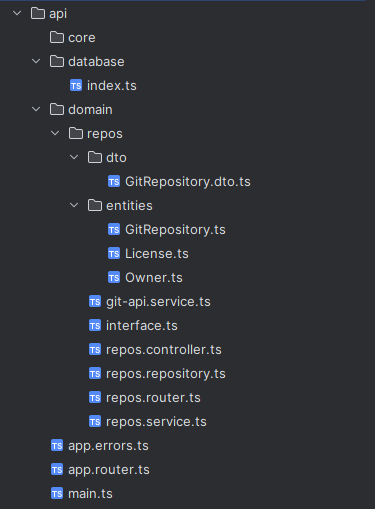
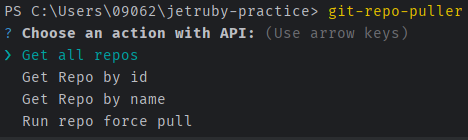
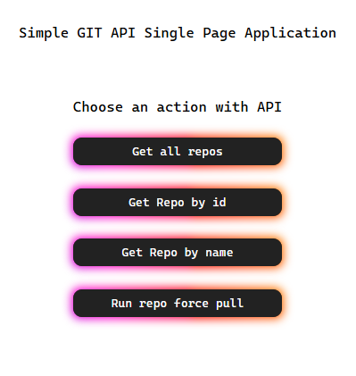

# Jetruby-practice
Summer 2025, Kubsu Practice

# API

## ENV
- GIT_API_KEY - key for github api
- DB_URI - mongodb connection string

## Technologies:
- Express - little framework to work with node:http/s, task is small as this framework, but scalable
- Mongoose - orm for MongoDB
- Axios - standard for api calls

## To be done in the future (not for this practice, I suppose and I'm too lazy)
- Logger - for now it is just node console, basically can be replaced with Winston or handmade alternative
- Auth - there is no authorization
- Swagger - empty
- Validation - class-validator, class-transformer, zod ...

#### For big application better alternative is **_NestJS_**

## Project Structure

## Why MongoDB?

MongoDB is a better fit for this task than SQL databases (PostgreSQL, MySQL) because repository data from the GitHub API comes as semi-structured JSON documents with nested fields. 
MongoDB can store them as-is, without complex schemas or JOIN operations, speeding up development. 
SQL databases would require rigid schemas and extra transformations, whereas simplicity and speed are key here.
If complex relationships or transactions were needed, SQL would be preferable—but for this use case, **it’s overkill**.

# Command Line Interface

## Technologies:
- commander - basic tool to work with cmd
- inquirer - declarative command line actions (input, chooser and etc)
- ora - cmd spinner
- colorette - colors for cmd

## How it looks like:

# Single Page Application

## Technologies:
- React - just this, only react
- Axios - for API calls

## How it looks like:
`